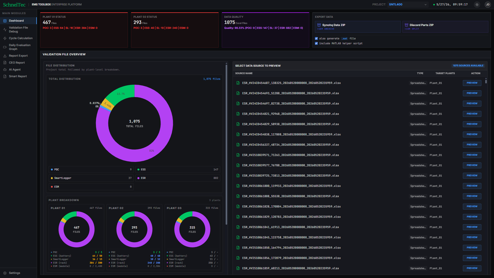

# DATA Visualization in ESS

This project is a standalone React + Vite application for ESS data visualization and analysis. It is no longer managed or deployed through AI Studio.

## Requirements

- Node.js 18+
- npm

## Local Setup

1. Install dependencies:
   `npm install`
2. Create a local environment file if you want Gemini-powered AI features:
   `cp .env.example .env.local`
3. Set your Gemini API key in `.env.local`:
   `GEMINI_API_KEY=your_key_here`
4. Start the development server:
   `npm run dev`
The app runs on `http://localhost:3000`.

## Available Scripts

- `npm run dev` starts the local Vite dev server
- `npm run build` creates a production build
- `npm run preview` previews the production build locally
- `npm run lint` runs the TypeScript check

## Notes

- AI Studio is not required to run this app.
- If you do not use the AI features, the main visualization UI can still be developed locally, but Gemini-related features may not work without a valid API key.
